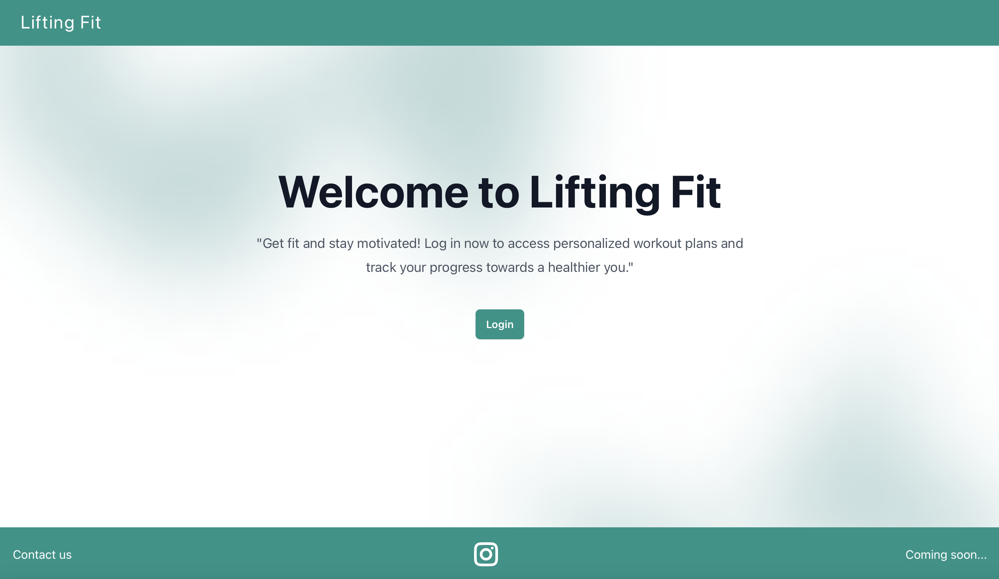
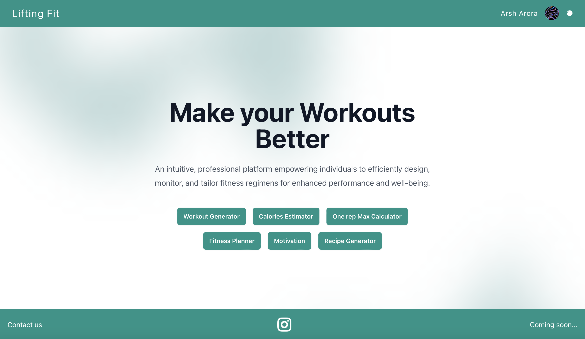
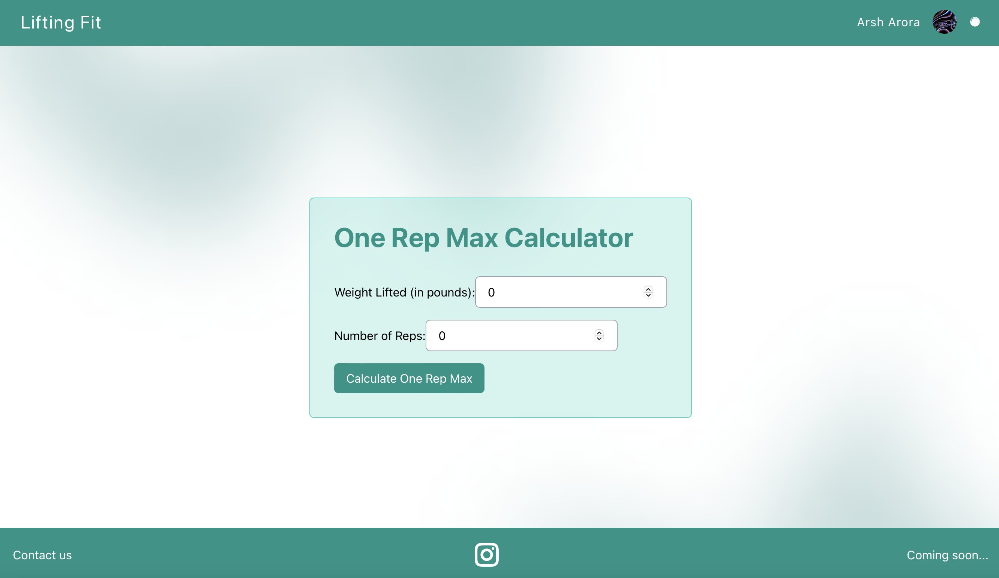
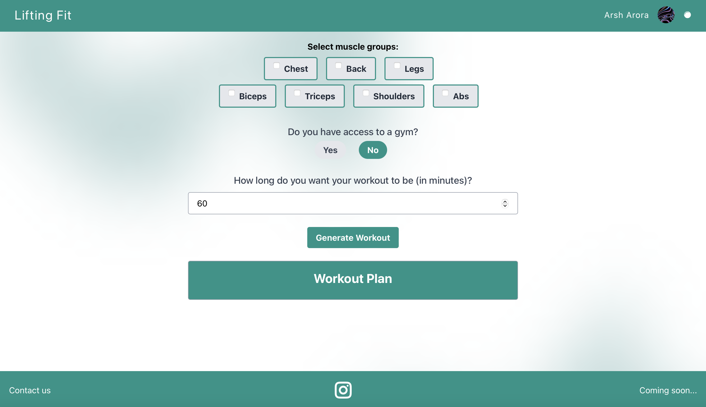

# Lifting-Fit

Lifting-Fit is a React-based web application focused on fitness and weightlifting. It provides various features to support users in their fitness journey, including a calorie estimator, contact page, fitness planner, footer, header, homepage, login page with Firebase integration, motivating area with quotes, one-rep max calculator, recipe generator, and workout generator.



## Prerequisites

Before running the project, make sure you have the following dependencies installed:

- Node.js
- NPM (Node Package Manager)

Apologies for the confusion. Here's an updated version of the installation section without the concurrently option:

## Installation

1. Clone the repository to your local machine:

   ```
   git clone <repository-url>
   ```

2. Navigate to the project's root directory:

   ```
   cd lifting-fit
   ```

3. Install the frontend dependencies:

   ```
   cd frontend
   npm install
   ```

4. Install the backend dependencies:

   ```
   cd ../backend
   npm install
   ```

## Running the Application

### Frontend

1. Start the frontend development server:

   ```
   cd ../frontend
   npm start
   ```

   The frontend server will be running on `http://localhost:3000`.

### Backend

1. Start the backend server:

   ```
   cd ../backend
   node server.js
   ```

   The backend server will be running on the specified port (e.g., `http://localhost:5000`).

Make sure to run both the frontend and backend servers simultaneously to ensure the full functionality of the Lifting-Fit application.

## Components

Certainly! Lifting-Fit is a web application built with React that focuses on fitness and weightlifting. It offers a range of features to support users in their fitness journey. Let's dive deeper into each component:

- `CalorieEstimator`: This component allows users to estimate their daily calorie intake based on various factors such as current weight, target weight, age, height, gender, activity level, and fitness goals. It utilizes OpenAI's GPT-3 language model to generate accurate calorie goals.

- `ContactPage`: The contact page component provides users with a way to get in touch with the Lifting-Fit team. Users can submit inquiries, feedback, or any other messages through this page.

- `FitnessPlanner`: This component assists users in planning their fitness activities for the week. It enables them to create and organize workout routines, track progress, and set fitness goals.

- `Footer` and `Header`: These components display the footer and header sections of the website, respectively. The footer usually contains useful links, copyright information, and additional details. The header typically includes the navigation menu, branding elements, and user authentication options.

- `Homepage`: The homepage serves as the main landing page of the website. It provides an overview of the application's features, highlights, and possibly testimonials or success stories.



- `LoginPage`: This component incorporates Firebase integration to offer user authentication functionalities. Users can log in using their credentials, providing a secure and personalized experience.

- `MotivatingArea`: This component showcases motivational quotes to inspire users and help them stay motivated throughout their fitness journey.

- `OneRepMaxCalculator`: The one-rep max calculator enables users to calculate their maximum strength for weightlifting exercises. Users can input their lifting weights and repetitions to determine their one-rep max.



- `RecipeGenerator`: This component generates recipes based on user preferences, such as dietary restrictions or desired meal types. It provides users with diverse and tailored meal ideas to support their nutrition goals.

- `WorkoutGenerator`: The workout generator generates customized workout routines based on user preferences, such as workout duration, target muscle groups, or fitness level. It offers users a variety of exercises and training plans to optimize their workouts.



These components collectively create an immersive and interactive fitness experience within the Lifting-Fit web application. Users can utilize the various tools and features to enhance their fitness journey, track progress, and access valuable resources.

## Contributing

Contributions to Lifting-Fit are welcome. If you would like to contribute, please follow these steps:

1. Fork the repository.

2. Create a new branch for your feature or bug fix.

3. Make the necessary changes and commit them.

4. Push your changes to your fork.

5. Submit a pull request describing the changes you've made.

## License

Lifting-Fit is licensed under the [MIT License](LICENSE).